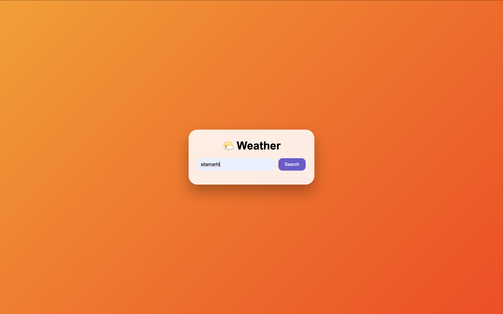
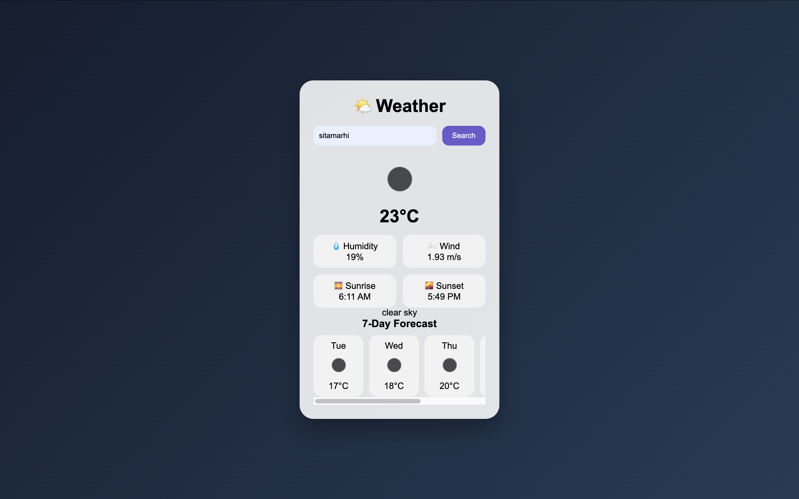

# 🌦️ Weather-ForecastingApp

> A real-time, intelligent weather forecasting web application powered by OpenWeatherMap API.  
> Built with HTML5, CSS3, and Vanilla JavaScript featuring dynamic theme adaptation and live 7-day forecasting.

---

##  Project Overview

**Weather-ForecastingApp** is a modern, responsive, and API-driven web application that delivers real-time weather intelligence for any city worldwide.

This project demonstrates:

- REST API integration
- Asynchronous JavaScript (async/await)
- Dynamic DOM manipulation
- Intelligent background theme switching
- Clean UI/UX design principles

It is designed to combine technical strength with immersive visual presentation.

---

#  Application Screenshots

---

1️⃣ Initial Interface (Search State)




**Features Visible:**
- Clean centered card layout
- City search input field
- Styled search button
- Warm gradient background
- Responsive structure

---

2️⃣ Weather Data with Dynamic Theme



**Displays:**
- 🌡️ Live Temperature
- 💧 Humidity Percentage
- 🌬️ Wind Speed
- 🌅 Sunrise Time
- 🌇 Sunset Time
- 📅 7-Day Forecast Cards
- Dynamic background theme based on weather condition

---

3️⃣ Development Preview

**Highlights:**
- Modular HTML structure
- Organized CSS theme classes
- Async API fetch logic
- Dynamic DOM rendering

---

# Core Features

### 🌍 Global City Search
Search real-time weather for any city worldwide.

### 🌡️ Real-Time Temperature
Instantly displays temperature data after API response.

### 💧 Humidity Monitoring
Shows atmospheric moisture levels in percentage.

### 🌬️ Wind Speed Tracking
Displays wind speed in meters per second.

### 🌅 Sunrise & Sunset Timing
Converts UNIX timestamps into readable local time format.

### 📅 7-Day Forecast
Automatically generates daily forecast cards dynamically.

### 🎨 Intelligent Theme Switching
The app automatically changes background based on:

| Condition | CSS Class |
|-----------|----------|
| Clear/Hot | `hot` |
| Cloudy | `cloudy` |
| Rain | `rainy` |
| Storm | `storm` |
| Night | `night` |
| Snow | `snow` |


# System Architecture

User Input
   ↓
Fetch API Call
   ↓
JSON Data Response
   ↓
Data Processing
   ↓
DOM Manipulation
   ↓
Dynamic Theme Rendering


#  Tech Stack

| Technology | Purpose |
|------------|----------|
| HTML5 | Structure |
| CSS3 | Styling & Gradients |
| JavaScript (ES6) | Logic & API Handling |
| OpenWeatherMap API | Weather Data Source |

---

#  Project Structure

Weather-ForecastingApp/
│
├── index.html        # Main UI Structure
├── style.css         # Styling & Theme Engine
├── script.js         # API & Dynamic Rendering Logic
├── README.md
└── screenshots/


#  Technical Implementation

 🔹 API Integration

- Uses OpenWeatherMap API
- Async/Await pattern
- Error handling for invalid city search
- JSON parsing for structured data

```javascript
const res = await fetch(apiURL);
const data = await res.json();
```

🔹 Dynamic Theme Engine

Based on weather condition and time, the app assigns a CSS class dynamically:

```javascript
document.body.classList.add("rainy");
```

Each class triggers a unique gradient background.


🔹 Forecast Rendering Logic

- Extracts daily forecast data
- Filters unique days
- Dynamically creates forecast cards
- Appends elements using `appendChild`

This makes the UI scalable and reusable.


# Example Output

| Metric | Example Value |
|--------|--------------|
| Temperature | 23°C |
| Humidity | 19% |
| Wind Speed | 1.93 m/s |
| Sunrise | 6:11 AM |
| Sunset | 5:49 PM |
| Condition | Clear Sky |


# API Setup Instructions

1. Visit https://openweathermap.org/api  
2. Create a free account  
3. Generate an API key  
4. Replace inside `script.js`:

```javascript
const apiKey = "e4dab62a43e3c9569164b26d09fe0075";


# Installation & Usage

1️⃣ Clone Repository

```bash
git clone https://github.com/your-username/Weather-ForecastingApp.git
```

 2️⃣ Navigate to Folder

```bash
cd Weather-ForecastingApp
```

 3️⃣ Run Application

Open `index.html` in your browser.


# Performance Optimization

- Lightweight (No frameworks used)
- Pure Vanilla JavaScript
- Efficient DOM updates
- Async API calls
- Minimal dependencies
- Smooth CSS transitions


# Future Enhancements

- 📍 Auto-location detection (Geolocation API)
- 🌡️ Celsius / Fahrenheit toggle
- 📊 Weather trend charts
- 🌍 Map integration
- 📱 Progressive Web App (PWA)
- 🔔 Weather alert notifications


# Learning Outcomes

This project demonstrates strong understanding of:

- RESTful API consumption
- Asynchronous programming
- Dynamic UI rendering
- Conditional styling
- Real-world application design
- Clean and maintainable code structure


